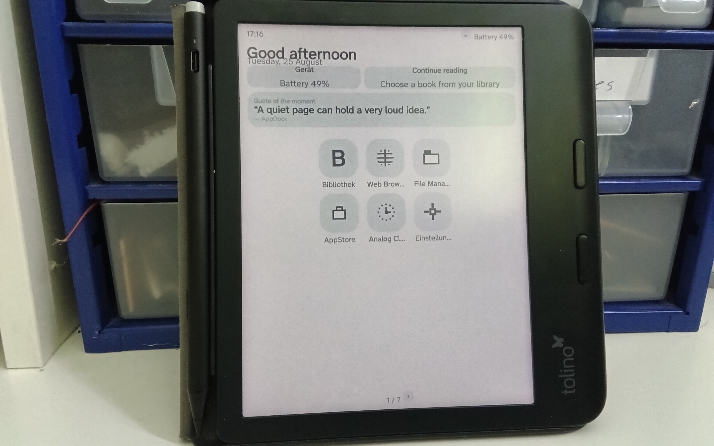
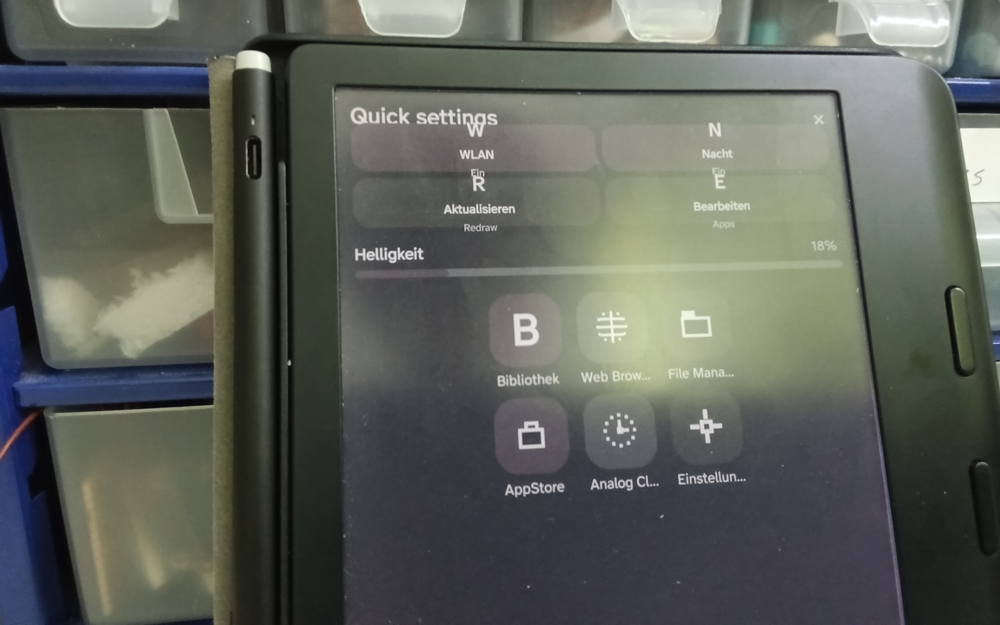
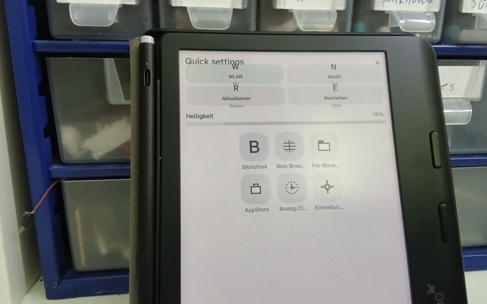
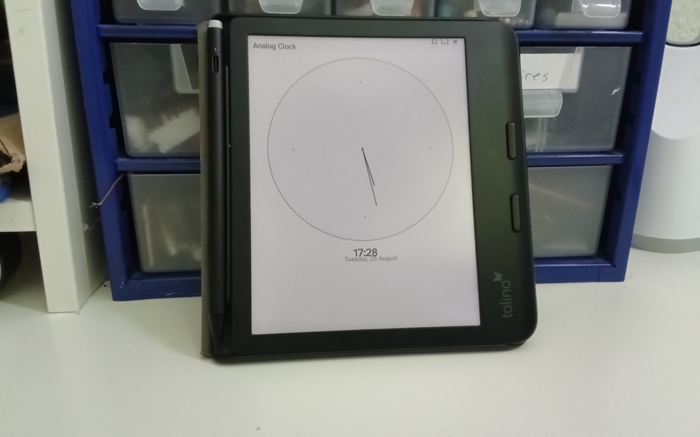
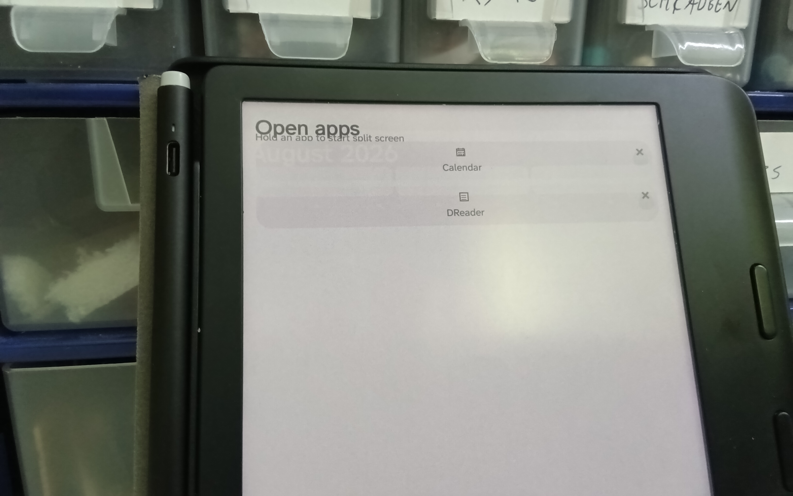
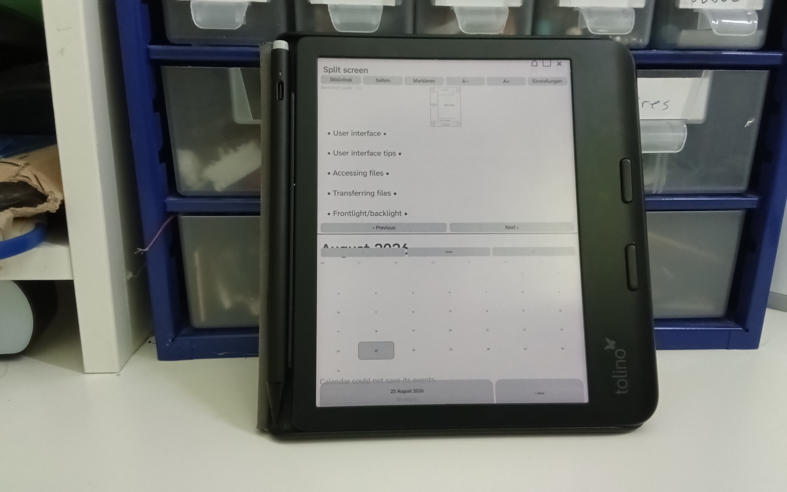
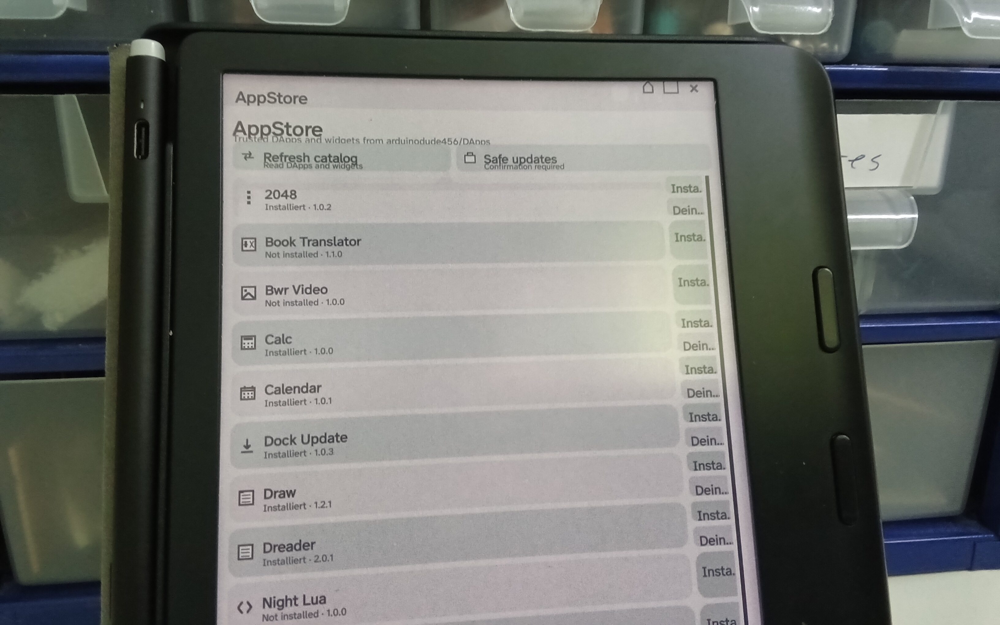
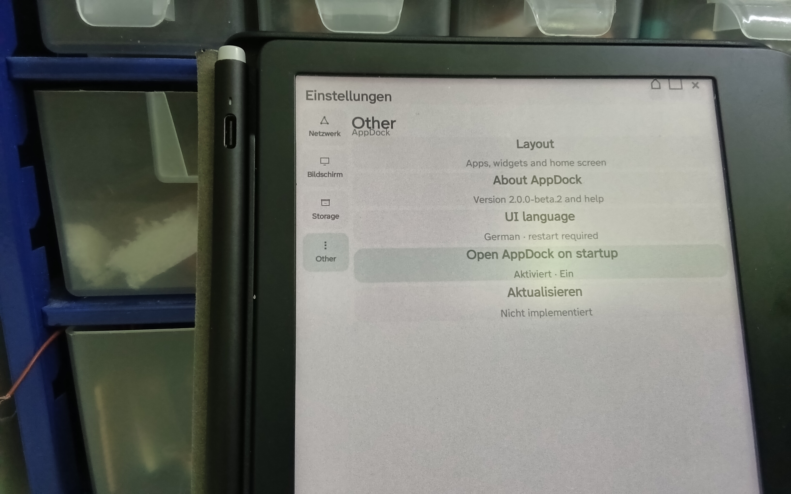
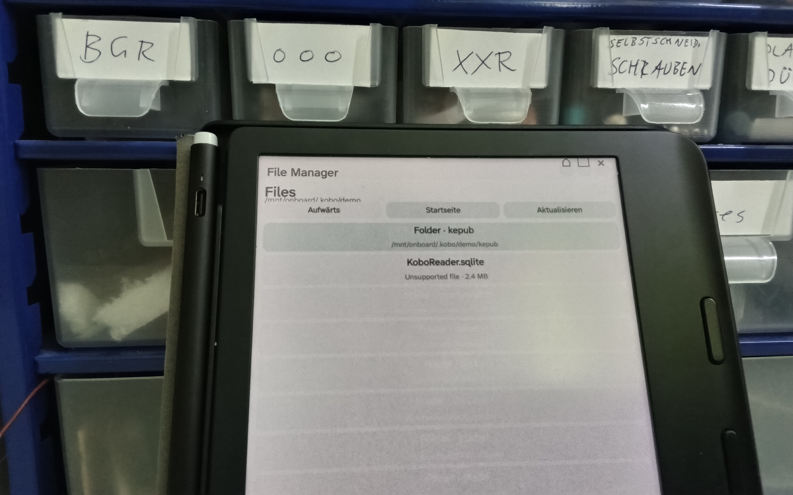
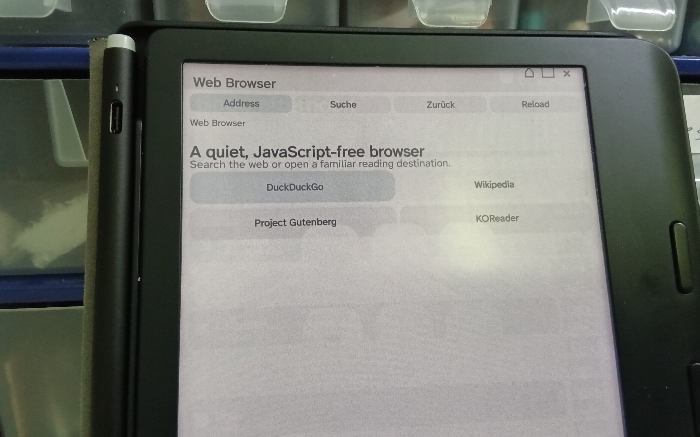

# AppDock

> **Language:** English · [Deutsch](README.md)

# New releases regulary commited at 3:00 AM CET

**AppDock** is a KOReader plugin that provides a customizable homescreen *inside* KOReader. Version **2.1.0** takes visual inspiration from Android 16 and **Material 3 Expressive**: a calm, cohesive color system, large rounded surfaces, clear information hierarchy, and quickly readable widgets. [1] [2]

> **E-Ink approach:** AppDock deliberately borrows the visual language and information structure, not Android's animations, blur, or transparency effects. This keeps updates economical and maintains contrast on monochrome readers.

## UI on real hardware

The following **unaltered original photographs** show AppDock during practical testing on a Tolino device. They have not been cropped, brightened, retouched, recompressed, or edited in any other way. They intentionally provide an honest impression of the current UI on real E-Ink hardware, including ambient light, camera perspective, and visible layout limitations.

### Homescreen and Quick Settings



*AppDock homescreen with greeting, battery status, quote widget, and six pinned apps.*



*Quick Settings in the dark theme with Wi-Fi, night mode, refresh, app editor, and brightness slider.*



*Quick Settings in the light theme on the same device.*

### DApps and multitasking



*Analog Clock running as an independent AppDock DApp.*



*Open Apps view with Calendar and DReader panes still open.*



*Split Screen view with DReader on top and Calendar below.*

### AppStore, Settings, and system DApps



*AppStore catalog with installed and not-yet-installed DApps.*



*Settings DApp with the Network, Display, Storage, and Other categories.*



*The dedicated AppDock File Manager with folder and file entries.*



*Web Browser DApp with address search and reading shortcuts.*

## Homescreen

| Area | Android-16-inspired AppDock implementation |
|---|---|
| System row | Time on the left and optional battery status on the right, without a heavy app bar. |
| Day area | A large greeting and date line create a clear visual hierarchy. |
| Widgets | Rounded **Device** and **Continue reading** cards plus installable Store Widgets with generous padding. |
| Apps | A consistent three-column icon grid with large rounded icon surfaces and concise labels. |
| Palette | Four Material-You-like presets and custom accent colors. On grayscale devices, fixed high-contrast KOReader gray roles are used. |
| Navigation | Discreet round page controls appear only when more than six apps are pinned. |
| Quick Settings | A drawn drop-down contains brightness, Wi-Fi, night mode, refresh, and the AppDock editor. |
| DApps | Stateful internal KOReader apps with their own pane, reusable drawn logos, and an Open Apps overview. |
| Periodic refresh | Every 60 seconds, AppDock requests a full E-Ink refresh to reduce ghosting and refresh static status information. |

Tap an app tile to start its assigned action. Hold an app tile to open management. Existing plugin discovery, adding and removing apps, and safe menu execution are retained.

## Installation

Extract the release archive and copy the complete `appdock.koplugin` directory into the plugin directory of your KOReader installation:

```text
…/plugins/
└── appdock.koplugin/
    ├── _meta.lua
    ├── main.lua
    ├── appdock_homescreen.lua
    ├── appdock_manager.lua
    ├── appdock_quicksettings.lua
    ├── appdock_dapps.lua
    ├── appdock_filemanager.lua
    ├── appdock_appstore.lua
    ├── appdock_theme.lua
    ├── appdock_logo.lua
    └── appdock_browser.lua
```

KOReader recognizes plugin folders by the `.koplugin` suffix and expects a `main.lua` file inside. Its plugin manager scans the standard plugin path and the `plugins` subdirectory of the data directory. [3]

Restart KOReader completely. Enable **AppDock Homescreen** under **More tools → Plugin management**, then open it through **AppDock Homescreen → Open homescreen**.

| Check | Expected result |
|---|---|
| Folder name | Ends exactly in `.koplugin`. |
| Plugin contents | Contains the listed core files directly inside the folder. |
| Start view | Greeting, date, widget cards, and a three-column app grid are visible. |
| Hold on a tile | Opens **Manage AppDock**. |

## DApps and Open Apps

**DApps** are AppDock-owned applications. Unlike a plugin shortcut, they remain logically open after leaving them and appear in **Open Apps**. Tapping a card restores that DApp; its small close control removes it from the list.

| DApp | Purpose | Notable behavior |
|---|---|---|
| **Analog Clock** | Drawn dial, hour/minute hands, digital time, and date. | Updates at the next minute boundary with a scoped fast refresh. |
| **Settings** | Android-inspired categories for network, display, storage, and other AppDock functions. | Side rail with mini logos; Wi-Fi, native brightness/warmth, themes, launcher layout, language, startup, and storage controls. |
| **Files** | A dedicated, scrollable AppDock file browser. | Large folder/file cards; **Up**, **Home**, and **Refresh**. `.lua` files can open in NightLua; DReader handles `.epub`, `.html`, `.htm`, and `.xhtml` after installation. |
| **AppStore** | Loads the catalog from [`arduinodude456/DApps`](https://github.com/arduinodude456/DApps). | Fetches `dapps.txt` over HTTPS, displays DApp and widget logos, detects updates, and requires confirmation for install, update, and uninstall. |
| **Web Browser** | Reads server-rendered web content and searches with DuckDuckGo HTML. | Start page, direct targets, reload, local history, and a focused reading mode; active web content stays disabled. |
| **Help** | Offline AppDock usage guide. | Explains the homescreen, Quick Settings, DApps, Split Screen, browser, and E-Ink refresh behavior. |

The logo library provides **38** drawn symbols for productivity, media, communication, data, and navigation. The full selection and the `logo` field are documented in [`DAPP_LOGOS.md`](DAPP_LOGOS.md).

DApps render only inside a pane rectangle assigned by the DApp host. A shared host can display two open DApps vertically in Split Screen without requiring those DApps to rewrite their layouts. Technical details are available in `DAPP_ARCHITECTURE.md` and `SPLITSCREEN_DESIGN.md`. [7] [8]

## Storage and launcher layout

In **Settings → Storage**, AppDock scans the accessible local KOReader data directory whenever the Settings pane is rebuilt. It displays the largest storage areas as a proportional E-Ink-friendly bar and a legend. Missing or unreadable directories are handled safely instead of producing an error.

Installed Store DApps are measured from their recorded installation files and displayed in descending order of their actual file size. This view measures the installed DApp files themselves; personal documents a DApp creates outside that installation path are intentionally not attributed to the DApp.

In **Settings → Display → Launcher layout**, you can choose compact, comfortable, or wide app spacing; switch logo surfaces between rounded boxes and circles; and enable the optional app search bar. The search bar filters pinned apps by title on the homescreen.

## Store Widgets, themes, and AppStore

AppDock supports a separate Store Widget contract alongside DApps. A widget provides `buildWidget(instance, context)` and receives only its local `context.dimen` geometry. Visible widgets are placed in their own homescreen cards. AppDock checks every minute whether a three-minute refresh interval has elapsed, then rebuilds the homescreen through the regular UI path. No background process or Android integration is required.

The **Quote Widget** contains three local quotes and changes its entry every three minutes. **Weather Widget** retrieves data through Open-Meteo over HTTPS and caches it. Store Widgets can be shown or hidden independently through **Manage apps and widgets → Store widgets**.

In **Settings → Display → Color themes**, choose **Lavender**, **Ocean**, **Forest**, or **Sunset**. **Create custom theme** accepts a name and a six-digit accent such as `#4F8CC9`. The selected theme applies to the homescreen, DApps, Quick Settings, and File Manager. On monochrome E-Ink devices, colors are deliberately mapped to stable contrast roles.

The **AppStore** reads its catalog from [`arduinodude456/DApps`](https://github.com/arduinodude456/DApps). Each `dapps.txt` line contains a relative Lua path and can include a version, an AppDock logo, and the type `widget`, for example `quote_widget.lua | 1.0.0 | help | widget`. Only the text catalog is loaded during refresh. Code is fetched through HTTPS only after visible user confirmation, checked for Lua syntax, and written atomically into the KOReader data directory.

> **Security note:** The catalog rejects absolute paths, duplicate entries, and paths containing `..`. A Store DApp runs as Lua code inside KOReader after installation. Use only a repository you trust.

## Web Browser and Quick Settings

The **Web Browser** DApp is a restrained JavaScript-free browser for readable server-rendered pages. It supports HTTP/HTTPS, redirects, DuckDuckGo HTML, relative links, and a small local history. It intentionally does not support JavaScript, forms, JavaScript-based logins, videos, WebSockets, downloads, or non-HTTP(S) links.

The small down-arrow tile in the system row opens a drawn Quick Settings interface. The brightness slider uses a fast regional E-Ink refresh, while the normal KOReader UI is also marked for redraw. Brightness changes never trigger a full refresh; AppDock's separate periodic 60-second refresh handles that role.

| Quick Setting | Result |
|---|---|
| **Brightness** | Tapping or dragging changes native frontlight intensity with a fast scoped refresh. |
| **Wi-Fi** | Switches Wi-Fi through KOReader's `NetworkMgr`. |
| **Night** | Triggers KOReader's existing `ToggleNightMode` event. |
| **Refresh** | Rebuilds the visible interface and requests a full refresh. |
| **Edit** | Closes Quick Settings and opens the AppDock editor. |

## Managing apps and widgets

AppDock offers regular KOReader plugins as apps only when they are already enabled, instantiated, and expose `addToMainMenu(menu_items)`. Confirmed DApps from the trusted AppStore catalog can also be installed. Plugins without a published menu action are not shown as apps, and the Store never installs files without visible confirmation. [3] [4]

| Setting | Effect |
|---|---|
| **Clock in status bar** | Shows or hides the time in the system row. |
| **Device status card** | Shows or hides the battery card and battery indicator. |
| **Current book card** | Shows or hides the active-book or library-hint card. |
| **Store widgets** | Shows installed Store Widgets and enables each widget independently. |
| **Add / Added** | Adds or removes a system or plugin app. |

The first six pinned apps occupy the current 3×2 page. Further apps appear on additional pages. The default tiles **Library**, **Menu**, **History**, and **Manage apps and widgets** remain available.

## Compatibility and limits

| Situation | Behavior |
|---|---|
| Color display | Uses Material-You-inspired accent surfaces. |
| Grayscale E-Ink | Uses the same contrast roles in stepped gray tones. |
| Plugin with one action | Starts that action directly. |
| Plugin with multiple actions | Opens an action dialog first. |
| Android system app | Deliberately not launched; AppDock operates only inside KOReader. |
| Hardware variation | Physical testing on more than one E-Ink reader is ongoing; Lua tests and hardware photos are provided as transparent evidence, not a compatibility guarantee. |

## Quality assurance

| Check | Result |
|---|---|
| Lua 5.1 syntax check for all plugin files | Passed. |
| Core smoke test | Passed: menu registration, plugin discovery, migration, app/widget management, and actions. |
| DApp smoke test | Passed: registry, Analog Clock, Settings, state retention, DApp host, recents, and closing. |
| File Manager test | Passed: listing, sorting, folder navigation, pane construction, and ReaderUI handover. |
| Theme and AppStore test | Passed: custom-theme persistence, safe manifest parsing, path traversal rejection, version comparison, updates, and confirmed installation/uninstall. |
| Storage regression | Passed: protected scan helpers, safe empty-path fallback, and Settings-pane construction. |
| Physical E-Ink validation | Ongoing across multiple devices. |

## References

[1] [Google: Material 3 Expressive for Android and Wear OS](https://blog.google/products-and-platforms/platforms/android/material-3-expressive-android-wearos-launch/)

[2] [Android Developers: Material Design 3 in Compose](https://developer.android.com/develop/ui/compose/designsystems/material3)

[3] [KOReader: PluginLoader](https://github.com/koreader/koreader/blob/master/frontend/pluginloader.lua)

[4] [KOReader: Plugin instantiation in FileManager](https://github.com/koreader/koreader/blob/master/frontend/apps/filemanager/filemanager.lua)

[7] [KOReader: File Manager helpers and library folder](https://github.com/koreader/koreader/blob/master/frontend/apps/filemanager/filemanagerutil.lua)

[8] [KOReader: ReaderUI and safe document startup](https://github.com/koreader/koreader/blob/master/frontend/apps/reader/readerui.lua)
